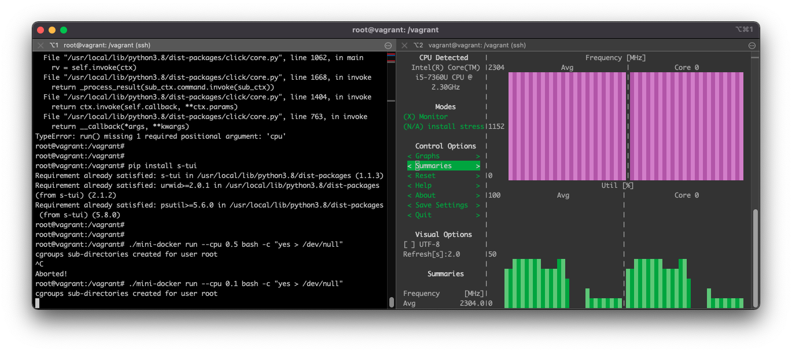

# Lessons

## Lesson 0. 準備

```
/
├── commands
│    ├── __init__.py
│    ├── config.py
│    ├── data.py
│    ├── format.py
│    ├── images.py
│    ├── pull.py
│    └── run.py
├── LESSONS.md
└── mini-docker
```

- mini-docker ファイル

mini-docker コマンド受け付けるpythonファイル

- commands ディレクトリ
コマンドラインの操作の実装ファイルが置いてある

コマンドとの対応関係 (詳細は、mini-docker ファイルを参照)

|       command        |      .py file      |
|----------------------|--------------------|
| ./mini-docker images | commands/images/py |
| ./mini-docker pull   | commands/pull.py   |
| ./mini-docker run    | commands/run.py    |


以下は、Lessonを進めるときに使用するヘルパーファイル
- commands/config.py
- commands/data.py
- commands/fetch.py
- commands/format.py
- commands/local.py


## Lesson 1. 子プロセスを立ち上げる

※ 以降のレッスンでのコマンドラインの実行に関して
- コマンドラインの操作はvagrant環境の中で実行する(`vagrant ssh`)
- vagrant内で、root権限を有していることとする (`sudo su -`)

### clone システムコールの確認

- ドキュメント https://linuxjm.osdn.jp/html/LDP_man-pages/man2/clone.2.html

### 1-1. clone システムコールを呼び出す

#### 実装
- ファイル `commands/run.py`
- 使用するモジュール `linux`
- 使用する関数 
  ```python
  linux.clone(
    callback: Callable[[], None], 
    flags: int, 
    *callback_args
  )
  ```

#### 確認 (VM)
```bash
cd /vagrant

./mini-docker run
```

### 1-2.子プロセスでコマンドを受け取れる

#### 実装①
- ファイル `mini-docker`
- 使用するモジュール `click`
  - 参照: https://click.palletsprojects.com
- 使用する関数アノテーション `@click.argument`


#### 実装② 〜子プロセスで任意のコマンドを実行する〜
- ファイル `commands/run.py`
- 使用するモジュール `os`
- 使用する関数 `os.execvp(file: str, args: str[])`


#### 実装③ 〜子プロセスのコマンドが終了するまでwaitする〜
- ファイル `commands/run.py`
- 使用するモジュール `os`
- 使用する関数 `os.waitpid(pid: int, options: int)`


#### 確認 (VM)
```bash
cd /vagrant
./mini-docker echo hello world
# ---> hello world
```

### 1-3. 子プロセスでpidを出力し確認

#### 実装
- ファイル `commands/run.py`
- 使用するモジュール `os`
- 使用する関数 `os.getpid()`

#### 確認 (VM)
```bash
cd /vagrant

ps
# --->
#   PID TTY          TIME CMD
# 43963 pts/0    00:00:00 sudo
# 43964 pts/0    00:00:00 su
# 43965 pts/0    00:00:00 bash
# 44061 pts/0    00:00:00 ps

./mini-docker run
# ---> 
# pid: 44064
```


## Lesson 2. プロセスを隔離

### 2-1. cgroupを利用してcpuを制限

#### 実装
- ファイル `commands/run.py`
- 使用するモジュール `commands.cgroup as cgroup`
- 使用するクラス `cgroup.CGroup`
  - 参照: https://github.com/francisbouvier/cgroups
- 使用する関数
    - `CGroup.set_cpu_limit(cpu: float)`
    - `CGroup.add(pid: int)`

### 2-2. コマンドラインのオプションからcpu上限を設定できるように変更

#### 実装
- ファイル 
  - `mini-docker`
  - `commands/run.py`
- 使用するモジュール `click`
- 使用する関数アノテーション `@click.option`


#### 確認
VMに2つのターミナルからsshする
- 1. 確認用のVM
- 2. プロセス立ち上げ用のVM

```bash
# 1. 確認用のVM
cd /vagrant

s-tui
```
参照: [amanusk/s-tui](https://github.com/amanusk/s-tui)


```bash
# 2. プロセス立ち上げ用のVM
cd /vagrant

./mini-docker run --cpu 0.5 bash -c 'yes > /dev/null'
# 1.確認用のVMでcpuの推移を見てみる
^C

./mini-docker run --cpu 0.1 bash -c 'yes > /dev/null'
# 1.確認用のVMでcpuの推移を見てみる
^C
```

結果  
指示通り50%制限 -> 10%制限ができている 


### 2-3. UTS名前空間を分離させる

#### 実装①
- ファイル `commands/run.py`
- 使用するモジュール `linux`
- 使用する関数 `linux.clone(callback: Callable[[], None], flags: int, *callback_args)`
- 使用するフラグ(UTS名前空間) `linux.CLONE_NEWUTS`

#### 実装② 〜子プロセスでhostnameを変更する〜
- ファイル `commands/run.py`
- 使用するモジュール `linux`
- 使用する関数 `linux.sethostname(hostname: str)`

#### 確認
プロセスでのhostname変更が、host側と分離されていることを確認

```bash
cd /vagrant

hostname
# ---> 
# vagrant

./mini-docker run
# ---> 
# set hostname: "container"

hostname
# ---> 
# vagrant
```

### 2-4. PID名前空間を分離させる

#### 実装①
- ファイル `commands/run.py`
- 使用するモジュール `linux`
- 使用する関数 `linux.clone(callback: Callable[[], None], flags: int, *callback_args)`
- 使用するフラグ(PID名前空間) `linux.CLONE_NEWPID`

#### 実装② 〜子プロセスでpidを出力する〜
- ファイル `commands/run.py`
- 使用するモジュール `os`
- 使用する関数 `os.getpid()`


#### 確認
子プロセスのpidがhost側と分離されていることを確認

```bash
cd /vagrant

ps a
# --->
#   PID TTY      STAT   TIME COMMAND
#   706 tty1     Ss+    0:00 /sbin/agetty -o -p -- \u --noclear tty1 linux
# 43950 pts/0    Ss     0:00 -bash
# 43963 pts/0    S      0:00 sudo su -
# 43964 pts/0    S      0:00 su -
# 43965 pts/0    S      0:00 -bash
# 44085 pts/0    R+     0:00 ps a

./mini-docker run 
# ---> pid: 44088
```


## Lesson 3. OverlayFs を使用してファイルをマウントする

### 3-1. pythonからイメージを扱う

#### 準備 コンテナに使用するイメージを取得する

- 使用するコマンド 
```bash
./mini-docker pull busybox
```

- 確認 
```bash
ls /var/opt/app/images/library_busybox_latest/contents/
```

#### 実装 busybox イメージをpythonから取得する

- ファイル `commands/run.py`
- 使用するモジュール `commands.local as local`
- 使用する関数 `local.find_images()`

### 3-2. イメージのファイル群をOverlayFsとしてマウントする

#### 実装① コンテナ用のディレクトリを用意
- 使用するモジュール `commands.data`
- 使用するクラス 
  - `Image`
  - `Container`
- 使用する関数
  - `Container.init_from_image(image: Image)`
- ディレクトリ構成
```
/var/opt/app/container/{image_name}_{version}_{uuid}
├── rw
└── work
```

- mountがごちゃついたときのtips
```
mount -t overlay | cut -d ' ' -f 3 | xargs -I@@ umount -f @@
```

#### 実装② 準備したディレクトリ群をoverlayfsとしてマウントする

- 使用するモジュール 
  - `linux`
  - `commands.data as data`
- 使用するクラス
  - `data.Image`
  - `data.Container`
- 使用する関数
  ```python
  rootdir = '???'
  lowerdir = '???'
  upperdir = '???'
  workdir = '???'
  linux.mount(
    'overlay',
    root_dir,
    'overlay',
    linux.MS_NODEV,
    f"lowerdir={lowerdir},upperdir={upperdir},workdir={workdir}"
  )
  ```

### 3-3. 子プロセスのルートディレクトリを変更する

#### 実装 
- 使用するモジュール `os`
- 使用する関数 
  - `os.chroot(path: str)`
  - `os.chdir(path: str)`


### overlayfsの動作確認 (VM)

```bash
cd /vagrant

./mini-docker run busybox /bin/sh

# 〜〜〜 プロセス内の処理 〜〜〜

ls -la
# --->
# total 68
# drwxr-xr-x    1 root     root          4096 Jul 13 03:05 .
# drwxr-xr-x    1 root     root          4096 Jul 13 03:05 ..
# drwxr-xr-x    2 root     root          4096 Jun 15 14:34 bin
# drwxr-xr-x    2 root     root          4096 Jun 15 14:34 dev
# ...

echo 'this file is created from container' > tmp.txt 

ls -la
# --->
# drwxr-xr-x    1 root     root          4096 Jul 15 12:48 .
# drwxr-xr-x    1 root     root          4096 Jul 15 12:48 ..
# drwxr-xr-x    2 root     root         12288 Jun  7 17:34 bin
# drwxr-xr-x    2 root     root          4096 Jun  7 17:34 dev
# ...
# drwxrwxrwt    2 root     root          4096 Jun  7 17:34 tmp
# ...

exit

# 〜〜〜 host の処理 〜〜〜

# tmp.txtがないことを確認

ls -la  /var/opt/app/images/library_busybox_latest/contents/
# --->
# drwxr-xr-x 10 root   root     4096 Jul 15 10:31 .
# drwxr-xr-x  4 root   root     4096 Jul 15 10:31 ..
# drwxr-xr-x  2 root   root    12288 Jun  7 17:34 bin
# drwxr-xr-x  2 root   root     4096 Jun  7 17:34 dev
# drwxr-xr-x  3 root   root     4096 Jun  7 17:34 etc
# drwxr-xr-x  2 nobody nogroup  4096 Jun  7 17:34 home
# drwx------  2 root   root     4096 Jun  7 17:34 root
# drwxrwxrwt  2 root   root     4096 Jun  7 17:34 tmp
# drwxr-xr-x  3 root   root     4096 Jun  7 17:34 usr
# drwxr-xr-x  4 root   root     4096 Jun  7 17:34 var

# tmp.txtはどこへ？

ls -la /var/opt/app/container/library-busybox_latest_<container_id>/
# ---> 
# drwxr-xr-x 1 root   root     4096 Jul 15 12:56 .
# drwxr-xr-x 3 root   root     4096 Jul 15 12:56 ..
# drwxr-xr-x 2 root   root    12288 Jun  7 17:34 bin
# drwxr-xr-x 2 root   root     4096 Jun  7 17:34 dev
# ...
# -rw-r--r-- 1 root   root       36 Jul 15 12:56 tmp.txt
# ...
# drwxr-xr-x 3 root   root     4096 Jun  7 17:34 usr
# drwxr-xr-x 4 root   root     4096 Jun  7 17:34 var

```


## Lesson 4. dockerイメージを指定して動かす

### 4-1. コマンドラインからイメージ名を指定できるように変更

#### 動作確認
```bash
# alpineコンテナを実行する
./mini-docker pull alpine
./mini-docker run alpine ash

# hello-worldコンテナを実行する
./mini-docker pull hello-world
./mini-docker run hello-world /hello
```

### 4-2. manifest.jsonのCMDをデフォルトコマンドとして使用できるように変更

#### 動作確認
```bash
./mini-docker run alpine

./mini-docker run hello-world
```
